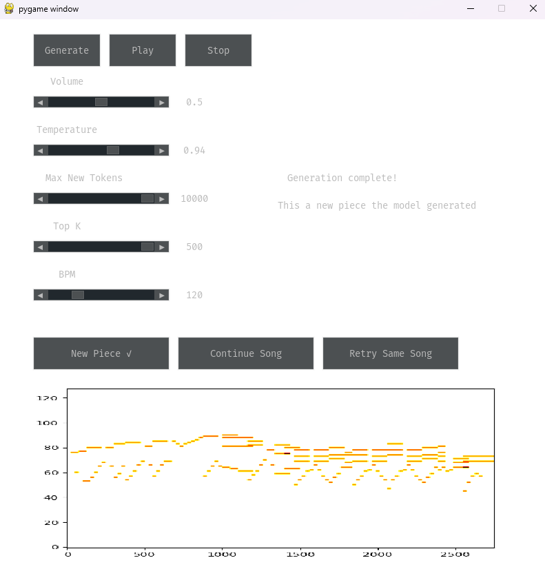
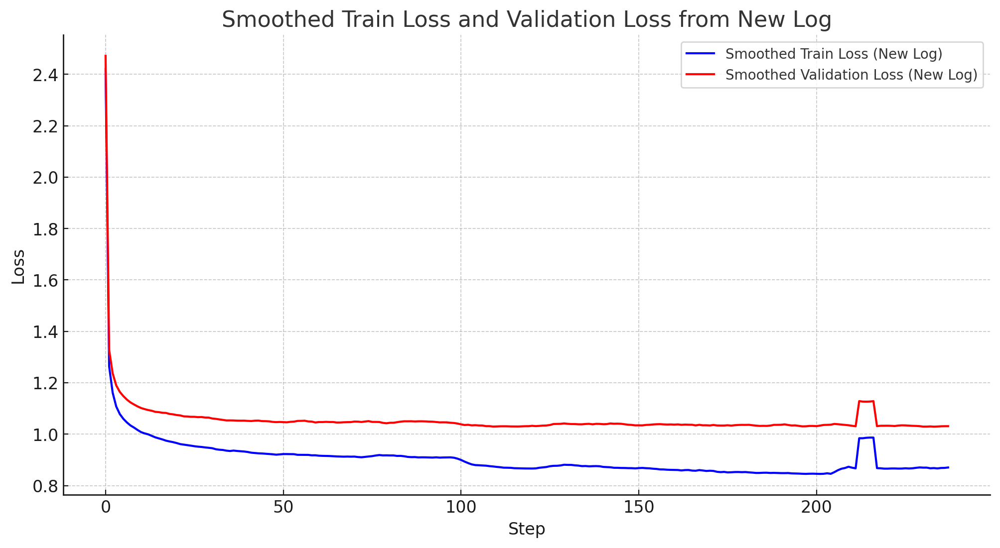
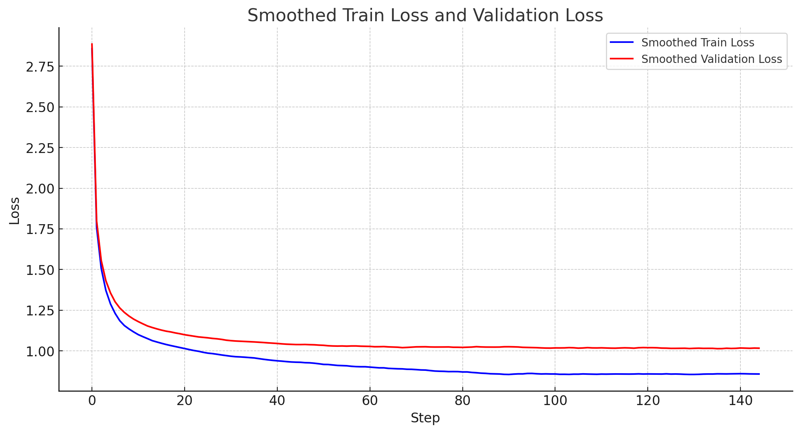

# nanoGPT for piano

This project extends the foundational work of Andrej Karpathy's nanoGPT, which focused on creating and training a GPT-2-based model. In our case, we have developed a graphical user interface (GUI) using the Pygame library to interact with a modified version of a GPT-2-like model. Our adaptation differs from the original nanoGPT in that it functions at the word level, as opposed to the character level.

In the scope of this project, the term "word" is specialized to mean one of two musical elements:
1) A pitch or a rest
2) The duration associated with that pitch or rest
   
Through the GUI, users have the option to:
1) Generate a completely new musical piece based on the model's training.
2) Create a continuation of a random song from the dataset on which the model was trained and also retry the continuation of the same song.

Additionally, the GUI offers controls for adjusting various parameters of the model's generation process, including:
1) Temperature: This affects the model's level of "creativity" in generating the piece.
2) Number of Tokens to Generate: This specifies the length of the generated output.
3) Top K Tokens: Users can select the top 'K' tokens to be considered during the generation process, while all other tokens are assigned a probability of zero.

## install

```
pip install torch numpy transformers datasets pygame pygame_gui pretty_midi music21
```

Dependencies:

-  'PyTorch'
-  'numpy'
-  'transformers' for huggingface transformers  (to load GPT-2 checkpoints)
-  'datasets' for huggingface datasets (if you want to download + preprocess OpenWebText)
-  'pygame'
-  'pygame_gui'
-  'pretty_midi'
-  'music21'

## quick start

to easily run the program, just run the UI_Pygame.py script either using the IDE or cmd, which opens the GUI and starts the program. (It might take a a little bit of time to load since it needs to load a 13M parameter model :D )


## GUI

- You can control each slider as you like
- Press an option from below :
     1) New Piece
     2) Continue Song (Retry Song works only if the last generation was from pressing the Continue Song button )
- After selecting an option, press Generate and wait until the text says Generation Complete! , and then you can press play to listen to the piece generated. 
  Also, the piano roll visual of the generated piece appears below :).




## Loss plots 

Due to my humble computation resources of only 1 GPU on my laptop, I only trained two models ( 5.6M and 13M parameters ) . Trying to train bigger models would be so slow and take a lot of time, my laptop might catch on fire if trained for too long on big models haha

- 5.6M model
  ** 3 Layers, 6 Heads, 384 embedding **



** The spike is because I changed the learning rate by mistake in an interval of time-steps during training 


- 13M model
  ** 4 Layers, 8 Heads, 512 embedding **



As we can see the 13M model performed better, this is an indication that more Layers/Heads can lead to better results. Adding more Layers can make the model capture and learn more complex patterns, Adding more heads can increase the attention to how different tokens affect/interact with each other in the input ( Input used is of size 200 tokens ). A better environment with better computation resources would allow further Hyperparameter tuning in hopes of achieving lower val/training loss.


## Encoding & Decoding MIDI to Text and Vice-Versa:

- Encoding from MIDI to Text
   -Reading MIDI: Utilizes the music21 library to parse the MIDI files.
   -Pitch and Duration: Iterates through the notes and chords to gather their pitch and duration.
   -Piano-Roll Array: Declares a piano-roll array where rows correspond to time-frequency windows and columns correspond to the range of pitches.
   -Places a '1' in the row corresponding to a note's start time and '2' in subsequent rows to indicate the note is sustained.
   -Text Conversion: Translates the filled array into words. Notes are denoted as n[pitch] d[duration] and rests are denoted by sepxx.
- Decoding from Text to MIDI
   -Reading Text: Parses the text representation starting with the token START and ending with END.
   -Array Conversion: Converts the parsed text back into a piano-roll array.
   -MIDI Generation: Uses the music21 library to convert the array back into a MIDI file.


- Example Text Encoding
   A sample text encoding might look like:
   ** START n60 d5 n62 d3 sepxx d2 n65 d4 END **
   In this example:
   START and END are tokens that signify the beginning and end of the text.
   n60 d5 denotes a note with a pitch of 60 lasting for 5 time steps.
   sepxx d2 represents a rest or no-note situation lasting for 2 time steps.

